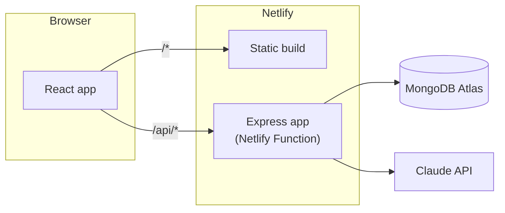

# Sift

Turn messy documents into structured, queryable data. Built as a take-home assignment for Zamp.

## What it does

1. Drop a document (PDF, photo/scan, or plain text) — or use the States panel's real "Nothing extractable" / "Upload failed" scenarios to see the failure paths without hunting for a bad file.
2. Claude reads it — whatever it is — and returns a document type guess, a plain-language summary, and a structured set of fields, each with a confidence score, a note if it needs human review (with concrete resolution options you can pick from), and a flag if it's sensitive. Click a field in Review and the exact span of source text it came from lights up — a real substring match against the model's own transcription, not hand-authored.
3. Ask questions across the whole corpus in plain language, and get an answer with citations back to the specific fields it's grounded in — or an explicit refusal when nothing supports an answer, never a guess. If two documents disagree, you're told; if the answer touches something sensitive, you're warned before you'd share it.

The interesting part isn't the CRUD — it's that the schema for "structured data" is different for every document and isn't known in advance. See `decisions.md` for how that shaped the storage, search, and extraction design, and for the security consideration in letting an LLM's output anywhere near a database query.

## Stack

React (Vite) · Express · MongoDB (Mongoose) · Claude (Anthropic API) · deployed on Netlify (static site + the Express app as a Netlify Function) with MongoDB Atlas.




Locally, the exact same Express app (`server/src/app.js`) runs via plain `app.listen()` instead of the Netlify Function wrapper — one codebase, no behavioral drift between local and deployed.

## Running it locally


### Prerequisites

- Node.js 20+
- A free [MongoDB Atlas](https://www.mongodb.com/cloud/atlas/register) cluster (M0 tier is enough)
- A free [Anthropic API key](https://console.anthropic.com/settings/keys) — the app still runs without one, it just can't extract or smart-search (see below)

### Setup

```bash
git clone <your-repo-url>
cd zamp-assignment
npm install
cp server/.env.example server/.env
```

Edit `server/.env` and fill in `MONGODB_URI` (required) and `ANTHROPIC_API_KEY` (optional but you'll want it — without it, uploads still save but extraction fails per-document with a clear message, and search silently falls back to keyword-only).

```bash
npm run dev
```

This runs the Express API (`:5050`) and the Vite dev server (`:5173`, proxying `/api` to the server — see `client/vite.config.js`) together. Open **[http://localhost:5173](http://localhost:5173)**.

### Running tests

```bash
npm test
```

60+ tests: unit tests for the query sanitizer (the NoSQL-injection-prevention layer — see `decisions.md` §8), the citation verifier and conflict detector behind `/ask` (§19, §21), the file-type classifier, and the search-text flattener; plus integration suites (supertest + an in-memory MongoDB, the model mocked) covering the full upload → extract → store → search → confirm-field → delete flow and the full `/ask` flow (grounded answers, forced refusals, conflicts, sensitivity), error paths, and regression tests for real bugs caught in manual testing (see `decisions.md` §13, §22, §24).

### Running the golden eval for `/ask`

```bash
npm run eval --workspace server
```

Not part of `npm test` — this seeds 5 synthetic documents through the *real* extraction pipeline and runs 16 golden questions against the *real* `/ask` endpoint, so it needs `ANTHROPIC_API_KEY` set and costs a small amount of real API usage. Reports retrieval accuracy (right documents cited) separately from generation accuracy (right answer, or correct refusal) — see `decisions.md` §22.

## Project layout

```
client/     React app (Vite)
server/     Express app + Mongoose models/routes/services — runs locally as-is
netlify/    Netlify Function wrapper around the same Express app
netlify.toml
decisions.md   <- the actual point of this repo
```


## Environment variables

See `[server/.env.example](./server/.env.example)` for the full list with explanations. The two that matter: `MONGODB_URI` (required) and `ANTHROPIC_API_KEY` (extraction + smart search; the app degrades gracefully without it rather than failing to start).