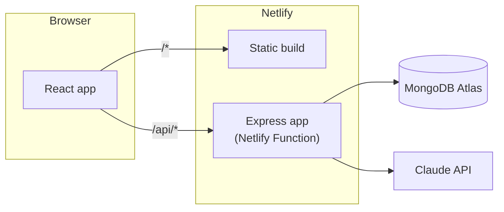

# Docstack

Turn messy documents — invoices, receipts, scribbled notes, scans, photos of handwriting, resumes, whatever shows up — into structured, queryable data. Built as a take-home assignment for Zamp.

**Live app:** _add your Netlify URL here after deploying_
**Design decisions:** see [`decisions.md`](./decisions.md) — the more revealing document of the two.

## What it does

1. Drop a document (PDF, photo/scan, or plain text) — or click a sample if you don't have one handy.
2. Claude reads it — whatever it is — and returns a document type guess, a plain-language summary, and a structured set of fields, with low-confidence fields flagged and genuinely unreadable documents flagged as such instead of guessed at.
3. Every document is searchable — plain keyword search always works; asking a question in plain language ("invoices over $100 from Acme") gets translated into a real filtered query, with an automatic fallback to keyword search if that doesn't pan out.

The interesting part isn't the CRUD — it's that the schema for "structured data" is different for every document and isn't known in advance. See `decisions.md` for how that shaped the storage, search, and extraction design, and for the security consideration in letting an LLM's output anywhere near a database query.

## Stack

React (Vite) · Express · MongoDB (Mongoose) · Claude (Anthropic API) · deployed on Netlify (static site + the Express app as a Netlify Function) with MongoDB Atlas.



Locally, the exact same Express app (`server/src/app.js`) runs via plain `app.listen()` instead of the Netlify Function wrapper — one codebase, no behavioral drift between local and deployed.

## Running it locally

### Prerequisites

- Node.js 20+
- A free [MongoDB Atlas](https://www.mongodb.com/cloud/atlas/register) cluster (M0 tier is enough)
- A free [Anthropic API key](https://console.anthropic.com/settings/keys) — the app still runs without one, it just can't extract or smart-search (see below)

### Getting a MongoDB Atlas connection string

1. [Create a free cluster](https://www.mongodb.com/cloud/atlas/register) (M0).
2. **Database Access** → add a database user (username + password).
3. **Network Access** → add `0.0.0.0/0` (fine for a demo project; tighten for anything real).
4. **Connect** → **Drivers** → copy the connection string, looks like `mongodb+srv://<user>:<password>@<cluster>.mongodb.net/...`.

### Setup

```bash
git clone <your-repo-url>
cd zamp-assignment
npm install
cp server/.env.example server/.env
```

Edit `server/.env` and fill in `MONGODB_URI` (required) and `ANTHROPIC_API_KEY` (optional but you'll want it — without it, uploads still save but extraction fails per-document with a clear message, and search silently falls back to keyword-only).

```bash
npm run dev
```

This runs the Express API (`:5050`) and the Vite dev server (`:5173`, proxying `/api` to the server — see `client/vite.config.js`) together. Open **http://localhost:5173**.

### Running tests

```bash
npm test
```

31+ tests: unit tests for the query sanitizer (the NoSQL-injection-prevention layer — see `decisions.md` §8), the file-type classifier, and the search-text flattener; plus an integration suite (supertest + an in-memory MongoDB, extraction mocked) covering the full upload → extract → store → search → delete flow, error paths, and two regression tests for real bugs caught in manual testing (see `decisions.md` §13).

## Deploying to Netlify

1. Push this repo to GitHub.
2. In Netlify: **Add new site → Import an existing project**, pick the repo. Build settings are already in `netlify.toml` (build command, publish directory, functions directory, and the `/api/*` redirect) — Netlify should pick them up automatically.
3. **Site settings → Environment variables**, add:
   - `MONGODB_URI` — same Atlas connection string as local (or a separate cluster/database for prod)
   - `ANTHROPIC_API_KEY`
4. Deploy. The site and the API are the same domain — no CORS configuration needed.

## Project layout

```
client/     React app (Vite)
server/     Express app + Mongoose models/routes/services — runs locally as-is
netlify/    Netlify Function wrapper around the same Express app
netlify.toml
decisions.md   <- the actual point of this repo
```

## Environment variables

See [`server/.env.example`](./server/.env.example) for the full list with explanations. The two that matter: `MONGODB_URI` (required) and `ANTHROPIC_API_KEY` (extraction + smart search; the app degrades gracefully without it rather than failing to start).
