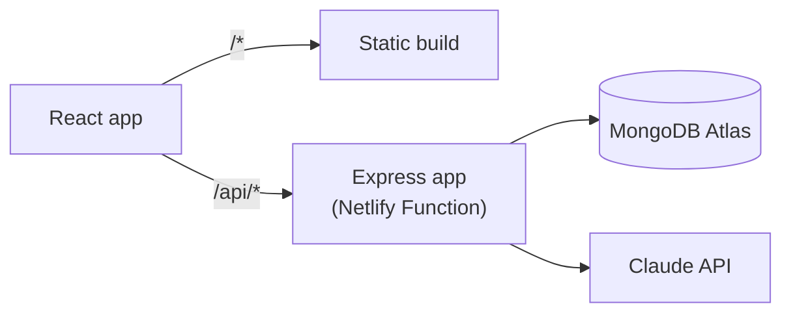

# Sift

Turn messy documents into structured, queryable data — without telling it what kind of document it's looking at.

**Live:** https://zamp-assignment.netlify.app · **Why it's built this way:** [`decisions.md`](./decisions.md)

---

## Who it's for

The person holding a document that matters, which they can't fully read: a 12-page rental agreement before signing, a prescription in handwriting they need to relay to a friend picking up medicines, an invoice they need to check.

Those documents share nothing structurally — which is why Sift never asks you to pick a document type or define a schema. It reads whatever you give it, extracts what's actually there, shows you where each value came from, tells you what it wasn't sure about, and warns you before you forward something sensitive.

## What it does

**Ingest** — drop a PDF, Word doc, photo, scan, or text file. Long documents are read in parts, with progress saved as it goes.

**Review** — the original on the left, extracted fields on the right. Click a field and the exact text it came from lights up. Uncertain readings show the alternatives and let you pick.

**Ask** — ask a question across everything you've uploaded. Answers cite the specific fields behind them, flag when two documents disagree, warn when they touch something sensitive, and refuse outright when nothing supports an answer.

## Running it

**You'll need:** Node 20+, a free [MongoDB Atlas](https://www.mongodb.com/cloud/atlas/register) cluster, and an [Anthropic API key](https://console.anthropic.com/settings/keys).

```bash
git clone https://github.com/palakbansal3233/zamp-assignment
cd zamp-assignment
npm install
cp server/.env.example server/.env     # then fill in MONGODB_URI and ANTHROPIC_API_KEY
npm run dev
```

Open **http://localhost:5173**. That's it — one install, one command, both the API (`:5050`) and the UI.

Without an `ANTHROPIC_API_KEY` it still runs: uploads save, extraction reports a clear reason per document, search falls back to keyword-only, and a banner explains why.

Your documents are private to your browser tab and are cleaned up when you leave — open the link in a second browser and you'll see an empty workspace, not someone else's files.

**Seeing the edge cases:** append `?demo=1` (e.g. `http://localhost:5173/?demo=1`) for a scenario switcher covering all 15 designed states — failed uploads, an unreadable scan, a refusal with no supporting field, conflicting sources. Six of them drive the real backend; the rest are labelled `(demo)`. It's kept out of the normal UI because it's a build tool, not a feature.

> **Atlas note:** under **Network Access**, add `0.0.0.0/0`. Serverless functions have no fixed IP, so allowing only your own machine works locally and fails in deployment.

## Tests

```bash
npm test                          # 112 tests
npm run eval --workspace server   # golden eval (makes real API calls)
```

The eval seeds 5 documents through real extraction and runs 16 questions against the real `/ask`, scoring retrieval accuracy separately from generation accuracy. Not part of `npm test` — it costs real API usage.

## Architecture

React (Vite) · Express · MongoDB (Mongoose) · Claude · one Netlify deploy.



The same Express app (`server/src/app.js`) runs under `app.listen()` locally and wrapped by `serverless-http` in deployment — one set of routes, no drift between what's tested and what ships.

```
client/    React app — three screens, one design system
server/    Express API, extraction + chunking + ask services, tests, eval
netlify/   Function wrapper around the same Express app
```

## Deploying

Connect the repo on Netlify — `netlify.toml` already carries the build command, publish directory, functions directory, and the `/api/*` redirect. Add `MONGODB_URI` and `ANTHROPIC_API_KEY` under **Site settings → Environment variables**, then redeploy (env changes don't apply to an existing build).
